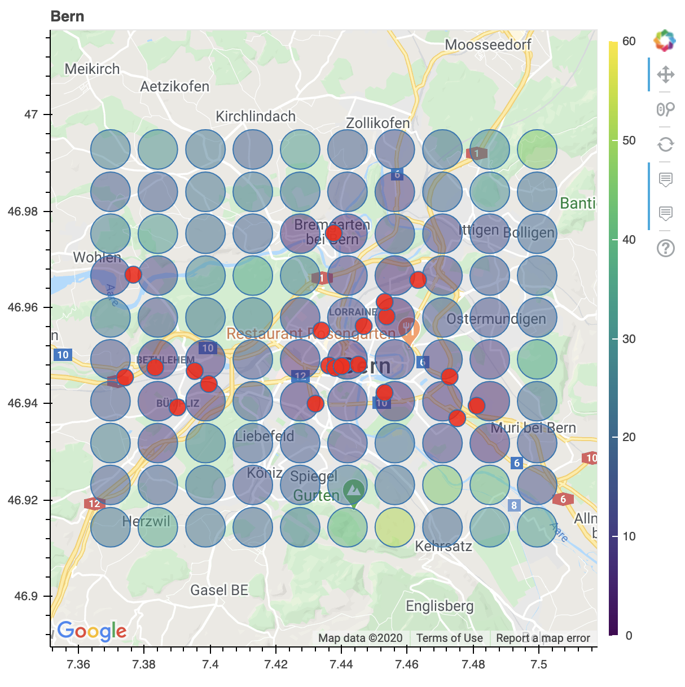

# bokehmap

Interactive bokeh map for the blog post I wrote:

https://medium.com/analytics-vidhya/gis-tools-in-python-bf9dc614fd2.

Go here to see interactive map:

https://davidfurrer.github.io/bokehmap/

